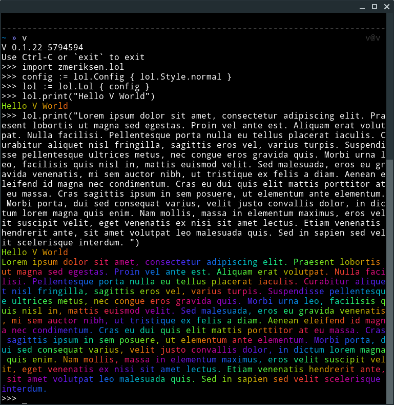

# lol

## Install

`v install zmeriksen.lol`

## Example:
```V
import zmeriksen.lol as Lol

fn main() {
	lol := Lol.Lol{
		lol.Config{
			lol.Style.normal
		}
	}
	lol.print("Hello V World")
}
```

## Screenshots



## Thanks

[jim bumgardner](https://krazydad.com/tutorials/makecolors.php)
